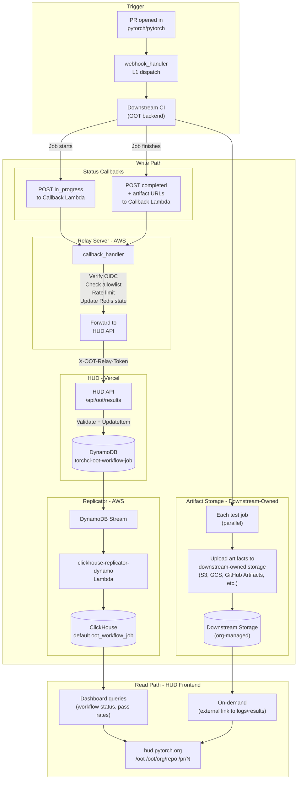
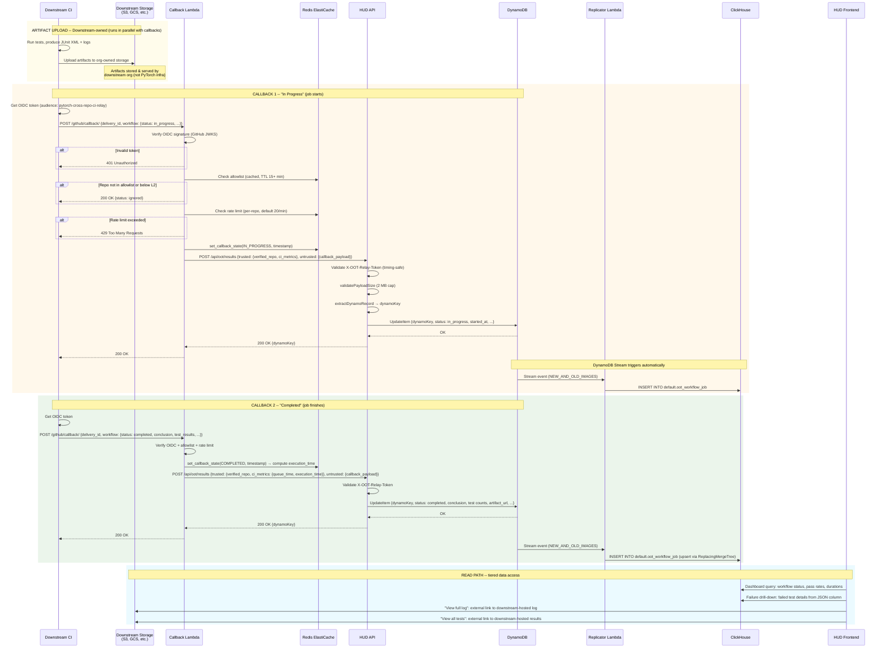

# RFC v4: HUD Ingestion Layer for Out-of-Tree CI Results

> **Authors**: [@subinz1](https://github.com/subinz1), [@jewelkm89](https://github.com/jewelkm89), [@NayanNagabhushana-28](https://github.com/NayanNagabhushana-28)
> **Status**: Implemented — synced with merged PRs (2026-06-03)
> **Supersedes**: `OOT_HUD_RFC_V3.md` (v3, 2026-04-16)
> **Aligned with**: [pytorch/test-infra#7937](https://github.com/pytorch/test-infra/issues/7937) (L1-L4 design by @can-gaa-hou) and @ZainRizvi's [storage architecture direction](https://github.com/pytorch/test-infra/issues/7937#issuecomment-4207729730)
> **Key change from v2**: Artifact storage (logs, test reports, full results) is now downstream-owned. Each organization manages their own storage; HUD only stores and links to externally-hosted URLs.

---

## Table of Contents

- [Abstract](#abstract)
- [Summary](#summary)
- [Status of Related Work](#status-of-related-work)
- [Problem Statement](#problem-statement)
- [Design Principles](#design-principles)
- [Architecture Overview](#architecture-overview)
  - [High-Level Diagram](#high-level-diagram)
  - [Detailed Sequence Diagram](#detailed-sequence-diagram)
  - [Data Flow Summary Table](#data-flow-summary-table)
- [Write Path: How Data Reaches HUD](#write-path-how-data-reaches-hud)
  - [Artifact Storage (Downstream-Owned)](#artifact-storage-downstream-owned)
  - [Status Callbacks (Two-Callback Model)](#status-callbacks-two-callback-model)
  - [Hop 1: Downstream to Result Lambda](#hop-1-downstream-to-result-lambda)
  - [Hop 2: Result Lambda to HUD API](#hop-2-result-lambda-to-hud-api)
  - [Hop 3: HUD API to DynamoDB](#hop-3-hud-api-to-dynamodb)
  - [Hop 4: DynamoDB to ClickHouse (Automatic)](#hop-4-dynamodb-to-clickhouse-automatic)
- [Read Path: How HUD Displays Results](#read-path-how-hud-displays-results)
  - [HUD Page Designs](#hud-page-designs)
- [Storage Design](#storage-design)
  - [DynamoDB Table](#dynamodb-table)
  - [ClickHouse Table](#clickhouse-table)
  - [Artifact Storage (Downstream-Managed)](#artifact-storage-downstream-managed)
  - [Data Retention](#data-retention)
- [DB Protection Layer](#db-protection-layer)
  - [Rate Limiting](#rate-limiting)
  - [Payload Caps](#payload-caps)
- [Authentication Flow](#authentication-flow)
- [Security Design](#security-design)
  - [OIDC Authentication](#oidc-authentication)
  - [L2 PR Security Measures (PR #7967)](#l2-pr-security-measures-pr-7967)
  - [Our Proposal: Signed One-Shot Callback Token](#our-proposal-signed-one-shot-callback-token)
- [Comparison: In-Tree vs OOT Pipeline](#comparison-in-tree-vs-oot-pipeline)
- [What Changed from v1](#what-changed-from-v1)
- [Implementation Plan](#implementation-plan)
- [Open Questions from RFC and related PRs](#open-questions-from-rfc-and-related-prs)
- [References](#references)

---

## Abstract

PyTorch HUD currently only ingests test results from in-tree CI, leaving out-of-tree (OOT) backends with no way to surface their results on the dashboard. This RFC defines the HUD ingestion and display layer which is in-line with the relay RFC (#90).

This v2 also aligns with @ZainRizvi's latest architectural direction ([#7937 comment](https://github.com/pytorch/test-infra/issues/7937#issuecomment-4207729730)): the write path goes through DynamoDB (mutable data, supporting the two-callback model from Issue #7937's L2 design) and is replicated to ClickHouse via the existing `clickhouse-replicator-dynamo` Lambda.

The pipeline: Downstream CI --> Result handler --> HUD API --> DynamoDB --> stream --> replicator --> ClickHouse. Artifact storage (logs, test reports, full results) is owned and managed by each downstream organization. HUD stores opaque artifact references (or handler-relative URLs); the **artifact handler** validates and redirects users to downstream-hosted storage — the browser does not open downstream URLs directly from HUD without that hop.

Some of the features on top of the #7937 foundation include test-level failure detail, rate limiting, payload caps, and OOT HUD page design.

---

## Summary

| Aspect | Design |
|--------|--------|
| **Write path (workflow status)** | Downstream --> Callback Lambda --> HUD API --> DynamoDB --> Stream --> Replicator Lambda --> ClickHouse (`default.oot_workflow_job`) |
| **Callback model** | Two callbacks per job: `in_progress` (job starts) + `completed` (job finishes) |
| **What goes to DynamoDB/ClickHouse** | Workflow job payload + relay-measured CI metrics (`queue_time`, `execution_time`) + test summary counts + artifact URLs |
| **Artifact storage** | Owned by downstream org (S3, GCS, GitHub Artifacts, etc.) — HUD only stores URLs and links out |
| **Test-level detail** | Failed/errored test details embedded in the "completed" callback payload (stored as JSON in DynamoDB) |
| **DB protection** | Per-repo rate limiting at callback handler (Redis), payload caps at HUD API (2 MB) |
| **HUD pages** | `/oot` (global summary), `/oot/[org]/[repo]` (per-backend), `/pr/[number]` (OOT section in PR view) — pending rename to `/crcr` |
| **Auth** | OIDC (downstream --> Lambda), `X-OOT-Relay-Token` (Lambda --> HUD, timing-safe comparison) |
| **DynamoDB key** | `{verified_repo}/{delivery_id}/{workflow_name}/{job_name}/{check_run_id}` |
| **DynamoDB write** | `UpdateItem` (not `PutItem`) — completed callbacks add fields without clobbering in_progress-only fields |
| **Reuses** | Existing DynamoDB --> ClickHouse replicator, existing `workflow_job` schema pattern |

---

## Status of Related Work

*As of 2026-06-03*

### Foundation (L1 Relay + Infrastructure)

| Item | Link | Status | Notes |
|------|------|--------|-------|
| Relay RFC (formal) | [pytorch/rfcs#90](https://github.com/pytorch/rfcs/pull/90) | **Merged** (2026-03-27) | Approved by @albanD |
| Relay RFC (tracking) | [pytorch/pytorch#175022](https://github.com/pytorch/pytorch/issues/175022) | Open | Ongoing coordination |
| L1-L4 Design Issue | [pytorch/test-infra#7937](https://github.com/pytorch/test-infra/issues/7937) | Open | @can-gaa-hou L1-L4 diagrams; @ZainRizvi storage direction |
| L1 Implementation | [pytorch/test-infra#7847](https://github.com/pytorch/test-infra/pull/7847) | **Merged** | @can-gaa-hou — L1 dispatch, allowlist, webhook handler |
| L1: CRCR Terraform | [pytorch/ci-infra#415](https://github.com/pytorch/ci-infra/pull/415) / [pytorch/ci-infra#433](https://github.com/pytorch/ci-infra/pull/433) | Closed / **Merged** | Lambda + API Gateway provisioning |
| DynamoDB Terraform | [meta-pytorch/pytorch-gha-infra#1064](https://github.com/meta-pytorch/pytorch-gha-infra/pull/1064) | Open | @ZainRizvi creating `torchci-oot-workflow-job` |

### L2 Callback Pipeline

| Item | Link | Status | Notes |
|------|------|--------|-------|
| L2 Implementation | [pytorch/test-infra#7967](https://github.com/pytorch/test-infra/pull/7967) | **Merged** (2026-05-22) | Callback handler, OIDC auth, Redis state, allowlist, rate limiting, HUD forwarding |
| Default callback URL | [pytorch/test-infra#8133](https://github.com/pytorch/test-infra/pull/8133) | **Merged** (2026-06-02) | `callback-url` input now optional — composite action embeds production Lambda URL |

### HUD Ingestion & Display (This RFC's scope)

| Item | Link | Status | Notes |
|------|------|--------|-------|
| ClickHouse schema | [pytorch/test-infra#8105](https://github.com/pytorch/test-infra/pull/8105) | **Merged** (2026-05-21) | `default.oot_workflow_job` table with `SharedReplacingMergeTree` |
| HUD Part 1/3: Queries + lib | [pytorch/test-infra#8110](https://github.com/pytorch/test-infra/pull/8110) | **Merged** (2026-05-22) | ClickHouse queries (`oot_summary`, `oot_pr_results`, `oot_backend_dashboard`), `ootUtils.ts`, unit tests |
| HUD Part 2/3: Frontend | [pytorch/test-infra#8111](https://github.com/pytorch/test-infra/pull/8111) | **Merged** (2026-05-26) | Pages (`/oot`, `/oot/[org]/[repo]`), `OotPrSection` component |
| HUD Part 3/3: API + replicator | [pytorch/test-infra#8112](https://github.com/pytorch/test-infra/pull/8112) | **Merged** (2026-05-30) | `/api/oot/results` endpoint, PR page integration, replicator mapping |
| Original monolithic PR | [pytorch/test-infra#8069](https://github.com/pytorch/test-infra/pull/8069) | **Closed** | Superseded by the 3-part split (#8110, #8111, #8112) |

### L2 Test Workflow

| Item | Link | Status | Notes |
|------|------|--------|-------|
| L2 test workflow | [pytorch/crcr-test#4](https://github.com/pytorch/crcr-test/pull/4) | **Merged** (2026-06-02) | Simulated build/test with randomized data, L2 callbacks, dispatched by `pytorch/pytorch` PRs |

### In Progress

| Item | Link | Status | Notes |
|------|------|--------|-------|
| L3/L4 check run management | [pytorch/test-infra#8119](https://github.com/pytorch/test-infra/pull/8119) | **Open** (WIP) | @can-gaa-hou — upstream check runs for L3/L4 jobs |
| HUD naming rename (`/oot` → `/crcr`) | Pending | Planned | Per feedback from @malfet and @jathu |
| Lambda `HUD_API_URL` provisioning | Pending | Blocked | @fffrog identified: env var needs to be set via GitHub Environment Secrets (`crcr-prod`), not manually in AWS |

---

## Problem Statement

PyTorch's HUD (`hud.pytorch.org`) only ingests test results from in-tree CI. Out-of-tree (OOT) backends -- custom accelerators, downstream device integrations -- have no supported path to push results to HUD.

The relay RFC ([#175022](https://github.com/pytorch/pytorch/issues/175022)) and its L1-L4 design ([#7937](https://github.com/pytorch/test-infra/issues/7937)) cover event dispatch, downstream triggering, callbacks, and workflow-level status. This RFC adds the **test-level detail, DB protection, and HUD page designs** that those documents leave unspecified.

---

## Design Principles

| Principle | What it means |
|-----------|---------------|
| **Align with maintainers** | Use the DynamoDB --> ClickHouse path prescribed by @ZainRizvi. Reuse existing replicator infra. Do not introduce competing storage patterns. |
| **Two-callback model** | Match Issue #7937's L2 design: `in_progress` when CI starts, `completed` when CI finishes. Status is mutable, so DynamoDB (not append-only ClickHouse) is the write target. |
| **Tiered data** | Workflow status + test summary in DynamoDB/ClickHouse for fast dashboard queries. Full logs and detailed test results hosted by downstream org — HUD links out to them. |
| **Downstream owns artifacts** | Each downstream organization is responsible for storing and serving their own logs, test reports, and full results. PyTorch infra does not provision or manage artifact storage for OOT backends. Downstream can use any publicly accessible storage (S3, GCS, Azure Blob, GitHub Artifacts, Google Drive, etc.). |
| **Secure by default** | OIDC at the edge, allowlist before HUD, internal token to HUD. |
| **Protect ClickHouse** | Rate limits and payload caps. OOT traffic must never degrade in-tree HUD queries. |
| **Simple for downstream** | Downstream repos only need a GHA OIDC token. No shared secrets, no DB access, no PyTorch-managed storage credentials. |

---

## Architecture Overview

### High-Level Diagram

This diagram shows the complete end-to-end data flow, from a PR being opened in PyTorch to results appearing on HUD. The left side shows the **write path** (how data gets in), and the bottom shows the **read path** (how HUD displays it).



### Detailed Sequence Diagram

This diagram shows the exact order of operations, authentication at each hop, and error handling.



### Data Flow Summary Table

| Phase | Step | Source | Destination | Auth | What Happens |
|-------|------|--------|-------------|------|--------------|
| **Artifacts** | -- | Each test job | Downstream-owned storage | Downstream org's own credentials | Upload logs, JUnit XML, full test results to org-managed storage |
| **Callback 1 (start)** | 1a | Downstream job | Callback Lambda | OIDC token | POST `in_progress` status via composite action |
| | 1b | Callback Lambda | Redis | Internal | Verify allowlist, rate limit, persist `IN_PROGRESS` state + timestamp |
| | 1c | Callback Lambda | HUD API | `X-OOT-Relay-Token` | Forward `{trusted, untrusted}` payload |
| | 1d | HUD API | DynamoDB | IAM | `UpdateItem` with `in_progress` status, started_at |
| | 1e | DynamoDB | ClickHouse | Stream + Lambda | Automatic replication |
| **Callback 2 (end)** | 2a | Downstream job | Callback Lambda | OIDC token | POST `completed` status + conclusion + test results + artifact URL |
| | 2b | Callback Lambda | Redis | Internal | Persist `COMPLETED` state, compute `queue_time` + `execution_time` |
| | 2c | Callback Lambda | HUD API | `X-OOT-Relay-Token` | Forward with relay-measured `ci_metrics` in trusted namespace |
| | 2d | HUD API | DynamoDB | IAM | `UpdateItem` — adds completion fields without clobbering in_progress fields |
| | 2e | DynamoDB | ClickHouse | Stream + Lambda | Automatic replication (upsert via `ReplacingMergeTree`) |
| **Read** | 3a | HUD Frontend | ClickHouse | Read-only | Dashboard queries: status, pass rates, durations (uses `FINAL` keyword) |
| | 3b | HUD Frontend | Downstream storage | Public URL | On-demand: external link to logs, full test results |

---

## Write Path: How Data Reaches HUD

### Artifact Storage (Downstream-Owned)

Artifact storage (logs, JUnit XML reports, full test results) is **owned and managed by each downstream organization**. PyTorch infrastructure does not provision, host, or manage any storage for OOT backend artifacts.

Each downstream org is free to use whatever storage solution suits them:
- AWS S3 (their own bucket)
- Google Cloud Storage
- Azure Blob Storage
- GitHub Actions native artifacts (`actions/upload-artifact`)
- Google Drive, or any other publicly accessible URL

The only requirement is that the downstream provides **publicly accessible URLs** (or URLs accessible to the person debugging the failure) in the "completed" callback payload. HUD stores these URLs and renders them as external links.

This design ensures:
- **No PyTorch infra cost** for artifact storage — each org pays for their own
- **No access control complexity** — PyTorch doesn't need to manage permissions for N downstream orgs
- **Full flexibility** — downstream teams choose storage that fits their existing infra
- **Debugging access** — the person responsible for debugging a downstream failure already has access to the downstream org's storage

### Status Callbacks (Two-Callback Model)

Following the L2 design from [Issue #7937](https://github.com/pytorch/test-infra/issues/7937):

**Callback 1 -- "In Progress"** (from the first job in the downstream workflow):
- Minimal payload: `downstream_repo`, `pr_number`, `pytorch_head_sha`, `workflow_run_id`, `status: "in_progress"`, `started_at`
- HUD shows the OOT CI run as "running" on the dashboard

**Callback 2 -- "Completed"** (from the last job in the downstream workflow):
- Full payload: everything from Callback 1, plus `conclusion`, `completed_at`, test summary counts, failed test details (as JSON array), artifact URLs (pointing to downstream-owned storage), environment metadata
- HUD updates the run to show pass/fail with drill-down to failures

The two-callback model is why DynamoDB is the write target: the status changes from `in_progress` to `completed`, requiring an upsert. DynamoDB handles this natively. ClickHouse is append-only and would require workarounds.

### Hop 1: Downstream to Callback Lambda

| Step | Action | Failure Response |
|------|--------|------------------|
| 1 | Verify OIDC token signature against GitHub JWKS (audience: `pytorch-cross-repo-ci-relay`) | `401 Unauthorized` |
| 2 | Extract `repository` claim as `verified_repo` | `401 Unauthorized` |
| 3 | Check `verified_repo` against Redis-cached allowlist (TTL 15+ min) | `200 OK {status: ignored}` (silent) |
| 4 | Verify repo is authorized at L2 or above | `200 OK {status: ignored}` (silent) |
| 5 | Per-repo rate limit check (Redis, default 20 req/min) | `429 Too Many Requests` |
| 6 | Validate dispatch record exists in Redis (prevents orphan callbacks) | `400 Bad Request` |
| 7 | Update callback state in Redis (`IN_PROGRESS` or `COMPLETED` + timestamp) | `400` (invalid state transition) / `503` (Redis outage) |
| 8 | Forward validated payload to HUD API as `{trusted, untrusted}` split | -- |

- **Service:** AWS Lambda (`cross_repo_ci_relay/callback/callback_handler.py`) with Function URL
- **Infrastructure:** Redis (ElastiCache) for allowlist cache, rate counters, state machine, CI timing
- **Outbound auth:** Attaches `X-OOT-Relay-Token` header (shared secret with HUD)
- **Composite action:** Downstream uses `pytorch/test-infra/.github/actions/cross-repo-ci-relay-callback@main` — callback URL is embedded as default (PR #8133)

**Payload Structure:**

The composite action (`cross-repo-ci-relay-callback`) constructs the callback payload and sends it to the Lambda. The Lambda then splits it into `trusted` (relay-generated) and `untrusted` (downstream-reported) namespaces before forwarding to HUD.

**What downstream sends to the Lambda (constructed by the composite action):**

```json
{
  "schema_version": "1",
  "delivery_id": "<from client_payload>",
  "payload": { "pull_request": {"number": 179565, "head": {"sha": "a1b2c3..."}}, "repository": {"full_name": "pytorch/pytorch"} },
  "workflow": {
    "status": "in_progress",
    "conclusion": null,
    "name": "OOT L2 CI",
    "url": "https://github.com/{org}/{repo}/actions/runs/24033272679",
    "job_name": "build-and-test",
    "check_run_id": "79235309937",
    "run_id": "24033272679",
    "run_attempt": 1,
    "started_at": "2026-06-03T02:37:16Z"
  }
}
```

**What the Lambda forwards to HUD (`{trusted, untrusted}` split):**

```json
{
  "trusted": {
    "verified_repo": "{org}/{repo}",
    "downstream_repo_level": 2,
    "ci_metrics": {
      "queue_time": 12.345,
      "execution_time": null
    }
  },
  "untrusted": {
    "callback_payload": {
      "delivery_id": "<delivery_id>",
      "payload": { "pull_request": {"number": 179565, "head": {"sha": "a1b2c3..."}}, "repository": {"full_name": "pytorch/pytorch"} },
      "workflow": {
        "status": "completed",
        "conclusion": "failure",
        "name": "OOT L2 CI",
        "url": "https://github.com/{org}/{repo}/actions/runs/24033272679",
        "job_name": "build-and-test",
        "check_run_id": "79235309937",
        "run_id": "24033272679",
        "run_attempt": 1,
        "started_at": "2026-06-03T02:37:16Z",
        "completed_at": "2026-06-03T02:38:01Z",
        "test_results": {
          "passed": 8410,
          "failed": 2,
          "skipped": 20,
          "total": 8432
        },
        "artifact_url": "https://github.com/{org}/{repo}/actions/runs/24033272679"
      }
    }
  }
}
```

> **Note:** `trusted.verified_repo` is the OIDC-proven identity — HUD should always use this over anything in the untrusted callback body. `trusted.ci_metrics` contains relay-measured timing that cannot be tampered with by downstream.

### Hop 2: Callback Lambda to HUD API

| Step | Action | Failure Response |
|------|--------|------------------|
| 1 | Validate `X-OOT-Relay-Token` header (timing-safe comparison via `crypto.timingSafeEqual`) | `401 Unauthorized` |
| 2 | Payload size validation (2 MB max body) | `413 Payload Too Large` |
| 3 | Extract DynamoDB record from `{trusted, untrusted}` payload | `400 Bad Request` (missing fields) |
| 4 | Write to DynamoDB via `UpdateItem` | `500 Internal Error` |

- **Service:** HUD Next.js API route (`torchci/pages/api/oot/results.ts`)
- **Retry behavior:** Lambda retries on HUD 5xx/network errors with exponential backoff (1s, 2s, 4s), up to 3 retries. HUD 4xx errors propagate immediately (no retry).
- **Known gap:** If `HUD_API_URL` env var is not set on the Lambda, the forward is silently skipped and the Lambda returns 200 to the caller anyway.

### Hop 3: HUD API to DynamoDB

The HUD API endpoint writes the workflow job payload to the `torchci-oot-workflow-job` DynamoDB table using `UpdateItem`:

```
dynamoKey = `${verified_repo}/${delivery_id}/${workflow_name}/${job_name}/${check_run_id}`
```

The key includes `check_run_id` (GitHub-assigned, unique per job execution) to ensure each job run maps to exactly one record, even across retries.

- **`UpdateItem` (not `PutItem`)**: The `extractDynamoRecord()` function builds a `SET` expression dynamically, only setting non-undefined fields. This prevents "completed" callbacks from clobbering "in_progress"-only fields (`started_at`, `queue_time`) with null.
- For "in_progress" callbacks: creates the record with `status`, `started_at`, `queue_time`, and metadata fields
- For "completed" callbacks: adds `conclusion`, `completed_at`, `execution_time`, test counts, `artifact_url` without overwriting existing fields

### Hop 4: DynamoDB to ClickHouse (Automatic)

This hop requires no new code. The existing infrastructure handles it:

1. **DynamoDB Streams** (enabled on the table with `NEW_AND_OLD_IMAGES`) automatically captures every write
2. **`clickhouse-replicator-dynamo` Lambda** receives stream events and inserts into ClickHouse
3. **Replicator mapping** (1 new line): `"torchci-oot-workflow-job": "default.oot_workflow_job"` in `lambda_function.py`

The ClickHouse table uses the same engine and patterns as the in-tree `workflow_job` table, so existing HUD query patterns work naturally.

---

## Read Path: How HUD Displays Results

### HUD Page Designs

#### Page 1: Per-Backend Dashboard -- `/oot/[org]/[repo]`

Per-backend CI health view.

```sql
SELECT pr_number, pytorch_head_sha, job_name, conclusion,
       started_at, completed_at, duration_seconds,
       total_tests, passed_tests, failed_tests, skipped_tests,
       workflow_run_url, artifact_url, environment
FROM default.oot_workflow_job
WHERE repository_full_name = {repo:String}
ORDER BY started_at DESC
LIMIT 100
```

Layout:
- Header: repo name, overall health (pass rate 24h/7d), environment summary
- Table: rows = PyTorch PRs, columns = OOT jobs. Green = `success`, red = `failure`, yellow = `cancelled`/`timed_out`, blue spinner = `in_progress`
- Click a red cell --> failure drill-down (parse `failed_tests_json` column for stacktraces)
- "View artifacts" link --> external link to downstream-hosted logs/results (opens in new tab)
- "View workflow run" link --> links to downstream GHA run URL
- Trend chart: pass rate over time

#### Page 2: Global OOT Summary -- `/oot`

Cross-repo overview for CI maintainers.

```sql
SELECT repository_full_name AS repo,
       countIf(conclusion = 'success') / count() AS pass_rate_7d,
       avg(duration_seconds) AS avg_duration,
       max(started_at) AS last_run
FROM default.oot_workflow_job
WHERE started_at > now() - INTERVAL 7 DAY
GROUP BY repo
ORDER BY pass_rate_7d ASC
```

- Table: repos sorted by pass rate (worst first)
- Repos below health threshold highlighted
- Click --> `/oot/[org]/[repo]`

#### Page 3: PR View Integration -- `/pr/[number]`

Collapsible "Out-of-Tree Backends" section below existing checks.

- Shows: backend name, conclusion (with color), duration, link to downstream run
- `in_progress` runs show a spinner
- Only rendered if OOT results exist for this PR
- Query: `WHERE pr_number = {pr:UInt64}`

---

## Storage Design

### DynamoDB Table

Table: `torchci-oot-workflow-job`

| Field | Type | Source | Description |
|-------|------|--------|-------------|
| `dynamoKey` (hash key) | String | Computed | `{verified_repo}/{delivery_id}/{workflow_name}/{job_name}/{check_run_id}` |
| `status` | String | `workflow.status` | `in_progress` or `completed` |
| `downstream_repo` | String | `trusted.verified_repo` | OIDC-verified downstream repo `org/name` (relay-trusted) |
| `upstream_repo` | String | `payload.repository.full_name` | Upstream repo (e.g. `pytorch/pytorch`) |
| `pr_number` | Number | `payload.pull_request.number` | PyTorch PR number |
| `pytorch_head_sha` | String | `payload.pull_request.head.sha` | PyTorch PR commit SHA |
| `delivery_id` | String | `callback_payload.delivery_id` | GitHub webhook delivery ID from L1 dispatch |
| `workflow_run_url` | String | `workflow.url` | Link to downstream GHA run |
| `workflow_name` | String | `workflow.name` | Downstream workflow name (`github.workflow`) |
| `job_name` | String | `workflow.job_name` | Downstream job name (`github.job`) |
| `check_run_id` | String | `workflow.check_run_id` | GitHub-assigned unique ID per job execution (`job.check_run_id`) |
| `run_id` | String | `workflow.run_id` | GHA run ID (`github.run_id`), same across retries |
| `run_attempt` | Number | `workflow.run_attempt` | Workflow run attempt number (`github.run_attempt`) |
| `conclusion` | String | `workflow.conclusion` | `success`, `failure`, `cancelled`, `timed_out` (set on "completed") |
| `queue_time` | Number | `trusted.ci_metrics` | Relay-measured dispatch-to-in_progress time in seconds |
| `execution_time` | Number | `trusted.ci_metrics` | Relay-measured in_progress-to-completed time in seconds |
| `started_at` | String | `workflow.started_at` | Downstream-reported ISO 8601 timestamp |
| `completed_at` | String | `workflow.completed_at` | Downstream-reported ISO 8601 timestamp (set on "completed") |
| `total_tests` | Number | `workflow.test_results` | Total test count (set on "completed") |
| `passed_tests` | Number | `workflow.test_results` | Passed test count |
| `failed_tests` | Number | `workflow.test_results` | Failed test count |
| `skipped_tests` | Number | `workflow.test_results` | Skipped test count |
| `failed_tests_json` | String | `workflow.test_results` | JSON array of failed/errored test details (set on "completed") |
| `artifact_url` | String | `workflow.artifact_url` | URL to downstream-hosted artifacts |
| `environment` | String | `workflow.environment` | JSON: `{"sdk": "<version>", "device": "<hardware>", ...}` |
| `downstream_repo_level` | String | `trusted.downstream_repo_level` | Relay-determined level at dispatch time: `L2`, `L3`, `L4` |

Terraform (already created by @ZainRizvi in [meta-pytorch/pytorch-gha-infra#1064](https://github.com/meta-pytorch/pytorch-gha-infra/pull/1064)):

```hcl
resource "aws_dynamodb_table" "torchci-oot-workflow-job" {
  name             = "torchci-oot-workflow-job"
  hash_key         = "dynamoKey"
  billing_mode     = "PAY_PER_REQUEST"
  stream_enabled   = true
  stream_view_type = "NEW_AND_OLD_IMAGES"
  attribute {
    name = "dynamoKey"
    type = "S"
  }
}
```

### ClickHouse Table

Table: `default.oot_workflow_job` (PR [#8105](https://github.com/pytorch/test-infra/pull/8105))

Engine: `SharedReplacingMergeTree` — allows upserts via `FINAL` keyword (in_progress → completed overwrites cleanly).

Key columns beyond the DynamoDB record:
- `repository_full_name` — `ALIAS` for `downstream_repo` (compatibility with existing `workflow_job` query patterns)
- `duration_seconds` — `ALIAS` computed as `dateDiff(second, started_at, completed_at)`
- `_inserted_at` — `MATERIALIZED now()` for replication tracking

Indexes: `bloom_filter` on `status`, `pr_number`, `downstream_repo`; `minmax` on `started_at`, `completed_at`.

```
ORDER BY (downstream_repo, delivery_id, dynamoKey)
```

Schema file: [`clickhouse_db_schema/default.oot_workflow_job/schema.sql`](https://github.com/pytorch/test-infra/blob/main/clickhouse_db_schema/default.oot_workflow_job/schema.sql)

### Artifact Storage (Downstream-Managed)

| Tier | Storage | Data | Managed By | Used For |
|------|---------|------|------------|----------|
| **Workflow status** | DynamoDB / ClickHouse | Status, conclusion, test counts, artifact URL, environment, failed test details | PyTorch infra | Dashboard, job grid, pass-rate trends, failure drill-down |
| **Full artifacts** | Downstream org's own storage | Logs, JUnit XML, full test results, build artifacts | Downstream org | On-demand debugging via external link from HUD |

HUD renders `artifact_url` as an external link. The downstream org decides:
- What storage to use (S3, GCS, GitHub Artifacts, Google Drive, etc.)
- What to store (logs, JUnit XML, full test JSON, build artifacts, core dumps, etc.)
- Access control (public, org-internal, team-restricted)
- Retention policy (7 days, 30 days, indefinite)

### Data Retention

| Storage | Retention | Mechanism |
|---------|-----------|-----------|
| DynamoDB | Indefinite (low volume) | DynamoDB TTL can be added if needed |
| ClickHouse | Follows `workflow_job` table retention | Same TTL/partition dropping as in-tree |
| Downstream artifacts | Downstream org's policy | Managed by downstream org |

---

## DB Protection Layer

### Rate Limiting

**Layer 1 -- Callback Lambda (Redis-backed, per-repo)**

```
Key:    oot:rate:{verified_repo}
Value:  counter (atomic INCR)
TTL:    1 minute sliding window
Limit:  20 requests/minute per repo (configurable via RATE_LIMIT_PER_MIN env var)
```

Rejects at the Lambda before any HUD/DB traffic. First line of defense against runaway CI loops.

### Payload Caps

| Limit | Value | Enforced at |
|-------|-------|-------------|
| Max request body | 2 MB | HUD API (`bodyParser` config) |
| Max `failed_tests_json` entries | 1,000 per request | HUD API schema validation |
| Max `stacktrace` length | 4 KB per test | HUD API (truncate before write) |
| Max `message` length | 1 KB per test | HUD API (truncate before write) |

### Daily Budget

Following the [DrCI rate limit pattern](https://github.com/pytorch/test-infra/blob/main/torchci/lib/rateLimit.ts):

| Tier | Daily job budget | Rationale |
|------|-----------------|-----------|
| Standard (L2) | 500 jobs/day | ~50 PRs/day x ~5 jobs x ~2 callbacks |
| Elevated (L3+) | 2,000 jobs/day | High-volume backends |

Exceeding the budget returns `429 Too Many Requests`. The allowlist YAML specifies the tier.

---

## Authentication Flow

| Hop | From --> To | Auth Mechanism | Credential Scope |
|-----|-------------|----------------|------------------|
| 1 | Downstream --> Callback Lambda | OIDC token (GHA-issued, audience `pytorch-cross-repo-ci-relay`, 5 min TTL) | No secrets needed by downstream |
| 2 | Callback Lambda --> HUD API | `X-OOT-Relay-Token` header (timing-safe comparison) | Shared secret: Lambda's `HUD_BOT_KEY` must match HUD's `OOT_RELAY_TOKEN` |
| 3 | HUD API --> DynamoDB | IAM role (Vercel-attached) | Write to `torchci-oot-workflow-job` only |
| 4 | DynamoDB --> ClickHouse | Replicator Lambda IAM | Existing replicator credentials |

**Security properties:**

| Property | How |
|----------|-----|
| Downstream never gets DB/HUD credentials | OIDC only — no shared secrets |
| Unknown repos rejected before HUD | Allowlist at Lambda (Redis-cached, TTL 15+ min) |
| HUD only accepts Lambda traffic | `X-OOT-Relay-Token` header (timing-safe comparison) |
| Runaway CI caught early | Rate limit at Lambda (Redis, 20/min per repo) + payload caps at HUD |
| Orphan callbacks rejected | Dispatch record must exist in Redis before callback is accepted |
| DB overload prevented | Payload caps (2 MB) + DynamoDB PAY_PER_REQUEST (auto-scales) |
| Trusted vs untrusted data | Relay splits payload: `trusted.verified_repo` (OIDC-proven), `untrusted.callback_payload` (downstream-reported) |
| Artifact storage not PyTorch's burden | Each downstream org manages their own |

---

## Security Design

### OIDC Authentication

The foundation of the callback security model. GitHub Actions provides a built-in OIDC provider that issues short-lived JWTs to running workflows.

**How it works:**

1. Downstream workflow declares `permissions: id-token: write`
2. GitHub's OIDC provider (`https://token.actions.githubusercontent.com`) mints a JWT signed with RS256
3. Token contains claims: `repository` (e.g. `intel/torch-xpu-ops`), `actor`, `ref`, `run_id`, etc.
4. Token has a 5-minute TTL — cannot be stockpiled or reused
5. Downstream sends token as `Authorization: Bearer <token>` to the Result Lambda
6. Lambda fetches GitHub's public keys (JWKS endpoint) and verifies the signature
7. Extracts `repository` claim as `verified_repo` — this is the only cryptographically trusted identity in the flow

**What OIDC gives us:**
- Zero secret management — downstream never handles API keys or shared secrets
- Caller identity — cryptographic proof of which repo is calling
- Short-lived — 5-minute TTL, auto-expires
- Unforgeable — signed by GitHub's private key, verified against public JWKS

**What OIDC does NOT give us:**
- No dispatch verification — proves *who* is calling, not *whether they were asked to call*
- No replay protection — a new OIDC token can be minted at any time for the same repo
- No scope-locking — doesn't bind the callback to a specific PR or SHA

### L2 PR Security Measures (PR #7967)

PR [#7967](https://github.com/pytorch/test-infra/pull/7967) builds on OIDC with additional measures:

1. **L2+ allowlist check** — `verified_repo` is checked against a Redis-cached allowlist (YAML hosted on GitHub, TTL 15+ min). Only repos at L2 or above can send callbacks. L1-only repos are silently ignored (200 OK with `"status": "ignored"`). This limits the attack surface to a known set of authorized repos.

2. **Trusted/untrusted payload split** — the payload forwarded to HUD is separated into two namespaces:
   - `trusted` — relay-generated fields: `verified_repo` (OIDC-proven identity) and `ci_metrics` (relay-measured `queue_time`, `execution_time`)
   - `untrusted` — downstream-reported data: `callback_payload` (the full callback body, passed through verbatim)
   - HUD should always prefer `trusted.verified_repo` over anything self-reported in the body

3. **Error asymmetry** — HUD 4xx errors (schema/validation) propagate back to downstream so workflow authors see a red CI step and can fix their payload. HUD 5xx and network failures are swallowed — a HUD outage should not turn every downstream L2 CI red. Operators alert on CloudWatch `HUD forward failed` patterns instead.

4. **CI timing metrics** — the relay measures `queue_time` (dispatch → in_progress) and `execution_time` (in_progress → completed) using Redis timestamps. These are in the `trusted` namespace, so they can't be tampered with by downstream.

**Known gaps acknowledged in PR #7967's README:**

- A compromised allowlisted repo can fabricate `workflow.status` / `workflow.conclusion` for PRs they were never dispatched for
- Replay attacks are possible — no dispatch-side nonce or one-shot state
- Any field inside the callback body can be tampered with
- All attacks are scoped to the attacker's own OIDC identity — they cannot impersonate another repo

### Our Proposal: Signed One-Shot Callback Token

To close the gaps above, we propose adding a signed callback token minted by L1 at dispatch time. The downstream doesn't need to know what's inside — they just echo back what they received in `client_payload`.

**How it works:**

```
L1 Dispatch:
  1. Mint JWT: sign({delivery_id, repo, pr_number, head_sha, dispatched_at}, SECRET)
  2. Store one-shot key in Redis: crcr:token:{delivery_id}:{repo} = valid (TTL 3 days)
  3. Include token in client_payload → downstream receives it

L2 Callback:
  1. Downstream echoes callback_token in the callback body
  2. Result Lambda verifies JWT signature (proves L1 minted it)
  3. Checks Redis key exists (proves token hasn't been consumed)
  4. Validates delivery_id + repo in token match OIDC verified_repo
  5. On "completed" callback: delete Redis key (one-shot, consumed)
  6. Forward to HUD
```

**What the callback token adds on top of OIDC + allowlist:**

1. **Dispatch provenance** — token can only be minted by L1 with the signing secret. Proves the relay actually dispatched this run, not that someone manually triggered a workflow.

2. **Replay prevention** — Redis key is consumed (deleted) after the "completed" callback. Replaying a captured callback finds no key and is rejected. Even with a valid token signature, the server-side state is gone.

3. **Fabrication blocking** — token payload contains the specific `pr_number` and `head_sha`. A compromised repo can only report results for the exact PR it was dispatched for, not for arbitrary PRs.

4. **Scope-locking** — token enforces `delivery_id` + `repo` + `pr_number` + `head_sha`. If any field in the callback body doesn't match the token, it's rejected.

5. **Orphaned job detection** — if a dispatch was sent but the downstream never responds, the Redis key expires without being consumed. This tells us a run was orphaned — HUD can auto-mark it as `timed_out` and trigger alerts instead of leaving it stuck as "in_progress" forever.

6. **Trusted queue time** — `dispatched_at` is embedded in the token payload. It's signed and tamper-proof, so `queue_time` can be computed without a Redis lookup (no cache miss risk).

7. **Per-dispatch rate limiting** — 1 token = exactly 2 allowed callbacks (`in_progress` + `completed`). Anything beyond that is rejected. More precise than per-repo counters.

8. **L3/L4 readiness** — when OOT results start gating PR checks or merges, self-reported data is not enough. The token provides cryptographic proof that the relay dispatched this specific run for this specific PR.

9. **Audit trail** — complete dispatch-to-result chain: token minted at dispatch, verified at callback, stored in DynamoDB. Answers "was this repo even dispatched for this PR?" definitively.

10. **Budget attribution** — count actual dispatches (tokens minted) vs callbacks received. Detect anomalies like a repo sending more callbacks than it was dispatched for.

**Summary:**

| Concern | OIDC Only (PR #7967) | OIDC + Callback Token (Our Proposal) |
|---------|---------------------|--------------------------------------|
| Dispatch provenance | Can't verify | Signed proof |
| Replay prevention | Vulnerable | One-shot Redis key |
| Fabrication blocking | Only identity check | Token locks to specific PR/SHA |
| Orphaned job detection | No way to know | Unconsumed Redis key = orphaned |
| Queue time (trusted) | Redis lookup, can miss | Embedded in token, tamper-proof |
| Scope-locking to PR/SHA | Downstream can claim any PR | Locked to dispatched PR/SHA |
| L3/L4 merge gating | Unsafe — self-reported data | Cryptographic proof of dispatch |
| Per-dispatch rate limiting | Per-repo only | Exactly 2 callbacks per dispatch |
| Audit trail | Partial | Complete dispatch-to-result chain |
| Budget attribution | Count callbacks | Count dispatches |

> **Note:** The callback token is not strictly required for L2 (dashboard only). However, L1 is where the token gets minted, and once L1 is deployed and downstream repos depend on the current `client_payload` shape, retrofitting it becomes a breaking change. We recommend adding it now as optional groundwork for L3/L4.

---

## Comparison: In-Tree vs OOT Pipeline

| | In-Tree | OOT (this RFC) |
|---|---------|-----------------|
| **Hops to ClickHouse** | 6 (job --> S3 --> workflow_run --> upload_stats --> S3 --> Lambda --> CH) | 5 (downstream --> Callback Lambda --> HUD API --> DynamoDB --> Stream --> Replicator Lambda --> CH) |
| **Write target** | S3 (`ossci-raw-job-status`) --> `clickhouse-replicator-s3` Lambda | DynamoDB (`torchci-oot-workflow-job`) --> `clickhouse-replicator-dynamo` Lambda |
| **Mutability** | Immutable (write once) | Mutable (in_progress --> completed via DynamoDB `UpdateItem`) |
| **Artifact storage** | S3 `gha-artifacts` via IAM role (LF Foundation managed) | Downstream org's own storage (any public URL) |
| **Auth model** | IAM roles (trusted same-org infra) | OIDC --> `X-OOT-Relay-Token` --> DynamoDB IAM |
| **What goes to CH** | Summary + failures (PRs), full results (main) | Workflow job payload + relay-measured CI metrics + test counts + artifact URL |
| **Rate limiting** | None (relies on GHA concurrency) | Per-repo at Lambda (Redis, 20/min) + payload caps at HUD (2 MB) |
| **Schema** | `default.workflow_job` | `default.oot_workflow_job` (`SharedReplacingMergeTree`, `FINAL` for upserts) |
| **Data trust model** | Fully trusted (same-org infra) | Split: `trusted` (relay-verified) + `untrusted` (downstream-reported) |

---

## What Changed from v1

| v1 (OOT_HUD_RFC_RESEARCH.md) | v2 (this doc) | Why |
|------|------|-----|
| Direct ClickHouse writes from HUD API | DynamoDB --> Stream --> Lambda --> ClickHouse | @ZainRizvi's direction: mutable data uses DynamoDB route |
| Separate `oot_ci` database | `default.oot_workflow_job` table | Align with existing `workflow_job` pattern |
| Custom `oot_ci_writer` scoped CH user | Not needed | DynamoDB route uses existing replicator Lambda credentials |
| Single callback after all tests | Two callbacks: in_progress + completed | Match Issue #7937 L2 design |
| Custom ClickHouse schema from scratch | Copy from `workflow_job` schema | Reuse proven schema, enable frontend code reuse |
| Circuit breaker (CH health probe) | Removed | DynamoDB is highly available; circuit breaker not in the write path |
| `async_insert` settings in HUD API | Removed | Replicator Lambda handles insert settings |
| Materialized view for monitoring | Deferred | Can be added later once data is flowing |
| **S3 artifact upload via PyTorch infra** | **Downstream-owned artifact storage** | Each org manages their own storage; HUD only stores URLs. Avoids PyTorch infra cost and access control complexity for N downstream orgs. |
| **Rate limiting at Lambda** | **Kept** | Not covered by Issue #7937 |
| **Payload caps** | **Kept** | Not covered by Issue #7937 |
| **HUD page designs** | **Kept** (updated queries to use `oot_workflow_job`) | Not covered by Issue #7937 |
| **Test-level failure detail** | **Kept** (embedded as JSON in DynamoDB record) | Not covered by Issue #7937 |

---

## Implementation Plan

### Phase 1: Infrastructure + HUD Endpoint — COMPLETE

| Deliverable | PR | Status |
|---|---|---|
| DynamoDB table (`torchci-oot-workflow-job`) | [meta-pytorch/pytorch-gha-infra#1064](https://github.com/meta-pytorch/pytorch-gha-infra/pull/1064) | Provisioned |
| ClickHouse schema (`default.oot_workflow_job`) | [#8105](https://github.com/pytorch/test-infra/pull/8105) | **Merged** (2026-05-21) |
| ClickHouse queries + utility library + tests | [#8110](https://github.com/pytorch/test-infra/pull/8110) | **Merged** (2026-05-22) |
| HUD API route (`/api/oot/results`) + replicator mapping | [#8112](https://github.com/pytorch/test-infra/pull/8112) | **Merged** (2026-05-30) |

### Phase 2: Callback Lambda — COMPLETE

| Deliverable | PR | Status |
|---|---|---|
| L2 callback handler (OIDC, allowlist, rate limiting, Redis state, HUD forwarding) | [#7967](https://github.com/pytorch/test-infra/pull/7967) | **Merged** (2026-05-22) |
| Composite action (`cross-repo-ci-relay-callback`) with default callback URL | [#8133](https://github.com/pytorch/test-infra/pull/8133) | **Merged** (2026-06-02) |

### Phase 3: HUD Pages — COMPLETE

| Deliverable | PR | Status |
|---|---|---|
| Frontend: `/oot` summary, `/oot/[org]/[repo]` dashboard, `OotPrSection` component | [#8111](https://github.com/pytorch/test-infra/pull/8111) | **Merged** (2026-05-26) |
| PR page integration (`/pr/[number]` OOT section) | [#8112](https://github.com/pytorch/test-infra/pull/8112) | **Merged** (2026-05-30) |

### Phase 4: End-to-End Validation — IN PROGRESS

| Deliverable | PR / Item | Status |
|---|---|---|
| L2 test workflow (`pytorch/crcr-test`) | [crcr-test#4](https://github.com/pytorch/crcr-test/pull/4) | **Merged** (2026-06-02) — actively receiving dispatches |
| Callback → Lambda | Working | Callbacks reporting HTTP 200 |
| Lambda → HUD forwarding | **Blocked** | `HUD_API_URL` env var not yet provisioned as Lambda env var (exists in Secrets Manager but code reads from `os.getenv`). @fffrog proposed fix: configure via `crcr-prod` GitHub Environment Secrets. |
| DynamoDB → ClickHouse replication | Untested | Blocked on HUD forwarding |
| HUD display | **No data** | `hud.pytorch.org/oot` shows "No OOT CI results" — blocked on Lambda env var |

### Phase 5: Remaining Work

| Item | Status | Notes |
|---|---|---|
| Provision `HUD_API_URL` + `HUD_BOT_KEY` via GitHub Environment Secrets | Pending | @fffrog coordinating |
| Set `OOT_RELAY_TOKEN` on Vercel (must match `HUD_BOT_KEY`) | Pending | Dev Infra |
| Rename `/oot` → `/crcr` in HUD pages | Planned | Per @malfet / @jathu feedback |
| `timed_out`/`cancelled` conclusion handling | Known issue | Composite action only accepts `success`/`failure`; edge cases need mapping |
| L3/L4 check run management | [#8119](https://github.com/pytorch/test-infra/pull/8119) | WIP by @can-gaa-hou |
| Onboard real downstream repos (Ascend NPU, RISC-V, etc.) | Pending | After E2E validation |

---

## Open Questions from RFC and related PRs

1. ~~**Failed test detail storage**: Embed as `failed_tests_json` String column in `oot_workflow_job` (simpler, one table), or create a separate DynamoDB table + ClickHouse table for test-level rows (more queryable, but more infra)?~~ **Resolved:** Embedded as `failed_tests_json` String column in both DynamoDB and ClickHouse. A separate table can be added later if needed for cross-repo flaky test detection.

2. ~~**Redis TTL**: Issue #7937 proposes 3 hours; @ZainRizvi recommends 3 days (GitHub can queue jobs for up to 3 days).~~ **Resolved:** 3 days (259,200 seconds), configurable via `OOT_STATUS_TTL` env var on the Lambda.

3. **Non-GHA CI support**: OIDC auth is GHA-specific. Jenkins/Buildkite would need pre-shared API keys. Deferred.

4. ~~**Backfill on failure**: If DynamoDB write fails, should the Lambda retry?~~ **Resolved:** The HUD API returns errors to the Lambda, which retries HUD 5xx/network errors with exponential backoff (up to 3 retries). HUD 4xx errors propagate to the caller immediately. No dead-letter queue for now.

5. **L3/L4 check run tracking**: WIP in PR [#8119](https://github.com/pytorch/test-infra/pull/8119). Uses Redis to track upstream check run IDs mapped to downstream job dispatches, with GitHub Checks API for creating/updating check runs on the PyTorch PR.

6. **Silent HUD forward skip** (discovered during E2E validation): When `HUD_API_URL` is not set as a Lambda environment variable, `forward_to_hud()` silently skips the write and the Lambda still returns HTTP 200 to the caller. There is no way for the downstream workflow to know its data was not saved. Consider adding a `hud_forwarded` field to the response body.

7. **`timed_out`/`cancelled` conclusion support**: The composite action (`cross-repo-ci-relay-callback`) only accepts `success` or `failure` as valid `conclusion` values. Other GitHub-standard conclusions (`cancelled`, `timed_out`) cause the action to exit with an error. Downstream workflows need to map these to `failure` before calling the action, or the action needs to be updated.

---

## References

### Design & Coordination
- [pytorch/rfcs#90](https://github.com/pytorch/rfcs/pull/90) — Merged relay RFC by @fffrog
- [pytorch/pytorch#175022](https://github.com/pytorch/pytorch/issues/175022) — Relay RFC tracking issue
- [pytorch/test-infra#7937](https://github.com/pytorch/test-infra/issues/7937) — L1-L4 design issue by @can-gaa-hou
- [ZainRizvi's storage architecture comment](https://github.com/pytorch/test-infra/issues/7937#issuecomment-4207729730) — DynamoDB route, code pointers, Terraform

### L1 Foundation
- [pytorch/test-infra#7847](https://github.com/pytorch/test-infra/pull/7847) — L1 implementation by @can-gaa-hou (merged)
- [pytorch/ci-infra#415](https://github.com/pytorch/ci-infra/pull/415) / [#433](https://github.com/pytorch/ci-infra/pull/433) — CRCR Terraform by @fffrog
- [meta-pytorch/pytorch-gha-infra#1064](https://github.com/meta-pytorch/pytorch-gha-infra/pull/1064) — Terraform PR for DynamoDB table (@ZainRizvi)

### L2 Callback Pipeline
- [pytorch/test-infra#7967](https://github.com/pytorch/test-infra/pull/7967) — L2 callback handler implementation (merged 2026-05-22)
- [pytorch/test-infra#8133](https://github.com/pytorch/test-infra/pull/8133) — Default callback URL in composite action (merged 2026-06-02)

### HUD Ingestion & Display (This RFC)
- [pytorch/test-infra#8105](https://github.com/pytorch/test-infra/pull/8105) — ClickHouse schema `default.oot_workflow_job` (merged 2026-05-21)
- [pytorch/test-infra#8110](https://github.com/pytorch/test-infra/pull/8110) — Part 1/3: ClickHouse queries, `ootUtils.ts`, unit tests (merged 2026-05-22)
- [pytorch/test-infra#8111](https://github.com/pytorch/test-infra/pull/8111) — Part 2/3: Frontend pages and components (merged 2026-05-26)
- [pytorch/test-infra#8112](https://github.com/pytorch/test-infra/pull/8112) — Part 3/3: API endpoint, PR page integration, replicator mapping (merged 2026-05-30)
- [pytorch/test-infra#8069](https://github.com/pytorch/test-infra/pull/8069) — Original monolithic PR (closed, superseded by 3-part split)

### E2E Validation
- [pytorch/crcr-test#4](https://github.com/pytorch/crcr-test/pull/4) — L2 test workflow with simulated tests and callbacks (merged 2026-06-02)

### In Progress
- [pytorch/test-infra#8119](https://github.com/pytorch/test-infra/pull/8119) — L3/L4 upstream check run management (WIP, @can-gaa-hou)

### Code References
- [`aws/lambda/cross_repo_ci_relay/callback/callback_handler.py`](https://github.com/pytorch/test-infra/blob/main/aws/lambda/cross_repo_ci_relay/callback/callback_handler.py) — L2 callback handler
- [`aws/lambda/cross_repo_ci_relay/utils/hud.py`](https://github.com/pytorch/test-infra/blob/main/aws/lambda/cross_repo_ci_relay/utils/hud.py) — HUD forwarding logic
- [`aws/lambda/cross_repo_ci_relay/utils/config.py`](https://github.com/pytorch/test-infra/blob/main/aws/lambda/cross_repo_ci_relay/utils/config.py) — Lambda configuration (`HUD_API_URL`, `HUD_BOT_KEY`, etc.)
- [`.github/actions/cross-repo-ci-relay-callback/action.yml`](https://github.com/pytorch/test-infra/blob/main/.github/actions/cross-repo-ci-relay-callback/action.yml) — Composite action for downstream callbacks
- [`torchci/pages/api/oot/results.ts`](https://github.com/pytorch/test-infra/blob/main/torchci/pages/api/oot/results.ts) — HUD API endpoint
- [`torchci/lib/oot/ootUtils.ts`](https://github.com/pytorch/test-infra/blob/main/torchci/lib/oot/ootUtils.ts) — DynamoDB record extraction, write logic, UI helpers
- [`clickhouse_db_schema/default.oot_workflow_job/schema.sql`](https://github.com/pytorch/test-infra/blob/main/clickhouse_db_schema/default.oot_workflow_job/schema.sql) — ClickHouse table schema
- [`aws/lambda/clickhouse-replicator-dynamo/lambda_function.py`](https://github.com/pytorch/test-infra/blob/main/aws/lambda/clickhouse-replicator-dynamo/lambda_function.py) — DynamoDB-to-ClickHouse replicator (includes OOT mapping)
- [`clickhouse_db_schema/default.workflow_job/schema.sql`](https://github.com/pytorch/test-infra/blob/main/clickhouse_db_schema/default.workflow_job/schema.sql) — In-tree `workflow_job` schema (base for OOT table)

### Superseded
- Out of tree accelerator CI integration with HUD v1.0 — Our v1 RFC draft (superseded by this document)
