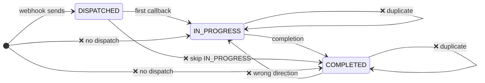

# RFC #96 — New Comments Analysis & Response Plan

> Comments from @KarhouTam and @can-gaa-hou (2026-05-09) on the L2 implementation alignment

---

## Comment 1 — @KarhouTam: "Why No record → completed should be accepted?"

### What they said

> Why No record → `completed` should be accepted?

Referring to our RFC's state machine table:


| Transition              | Action                                           |
| ----------------------- | ------------------------------------------------ |
| No record → `completed` | Accepted (handles missed `in_progress` callback) |


### Context from L2 PR

The L2 PR's `set_callback_state()` in `redis_helper.py` **rejects** `COMPLETED` without a prior `IN_PROGRESS`:

```python
elif state == CallbackState.COMPLETED:
    if current_record is None:
        logger.warning(
            "rejecting COMPLETED without prior IN_PROGRESS ..."
        )
        return False
```

Additionally, the L2 PR now requires a `DISPATCHED` state (set by the webhook handler) before any callbacks are accepted.

### Proposed response

Thanks @KarhouTam — you're right, the RFC's state machine was more lenient than needed. The original rationale was to handle cases where the `in_progress` callback was lost (network issues, Lambda timeout), so we wouldn't silently drop the final test results.

However, with the L2 PR's current implementation using `check_run_id` as the per-job key, each job execution is unique — if `in_progress` is lost for a specific `check_run_id`, it means something went wrong with that specific execution, and accepting a `completed` without it would bypass the state integrity check.

We'll update the RFC to match the L2 implementation: `No record → completed` is **rejected**.

### Changes needed

**RFC document (`RFC-0054`):**

- Update the State Machine table:
  - `No record → completed` → change from "Accepted" to **"Rejected (no prior in_progress)"**
  - Add the `DISPATCHED` prerequisite state
  - Update the state diagram to show the 3-state model: `DISPATCHED → IN_PROGRESS → COMPLETED`

---

## Comment 2 — @KarhouTam: `check_run_id` vs `run_attempt` + new workflow fields

### What they said

> In my state machine implementation, the Redis key now includes `check_run_id` instead of `run_attempt`. Since both values change with reruns, I believe `check_run_id` is a better fit for representing a unique job than `{job_name}:{run_attempt}`. Accordingly, the Redis state key has been updated to `oot:state:{delivery_id}:{repo}:{check_run_id}`.
>
> To improve HUD usability, I added `run_id` and `job_name` to the `workflow` dictionary, which keep consistent among all runs. This allows the HUD to use a grouping key like `{job_name}:{run_id}`, preventing a single downstream workflow from appearing as multiple rows due to reruns.

### Context from L2 PR

The callback action (`action.yml`) now sends these new fields in the `workflow` dict:

```yaml
JOB_NAME: ${{ github.job }}
CHECK_RUN_ID: ${{ job.check_run_id }}
RUN_ID: ${{ github.run_id }}
RUN_ATTEMPT: ${{ github.run_attempt }}
```

- `**check_run_id**` — unique per job execution (changes on retries). Used as the Redis state key.
- `**run_id**` — unique per workflow run (stays the same across retries of the same run). Good for HUD grouping.
- `**job_name**` — `github.job` (the job ID within the workflow YAML). Stays the same across retries.
- `**run_attempt**` — still sent but not used by the relay's state machine (only for informational purposes).

The relay's Redis state key is: `oot:state:{delivery_id}:{repo}:{check_run_id}`

The HUD grouping suggestion is: `{job_name}:{run_id}` — this groups reruns of the same job together, preventing duplicate rows.

### Proposed response

Great improvements @KarhouTam. `check_run_id` is indeed a better uniqueness key than `run_attempt` since it's GitHub-assigned and unique per execution — no ambiguity. We'll update the RFC and implementation to align:

1. **DynamoKey**: Change from `{repo}/{delivery_id}/{workflow_name}/{job_name}/{run_attempt}` to `{repo}/{delivery_id}/{workflow_name}/{job_name}/{check_run_id}` — this ensures each job execution gets its own DynamoDB record.
2. **HUD grouping**: Frontend will group by `{job_name}:{run_id}` to show reruns of the same job as a single row (with the latest attempt displayed).
3. **New fields**: Add `check_run_id`, `run_id`, and `schema_version` to the `RelayWorkflow` interface.

### Changes needed

**RFC document (`RFC-0054`):**

- Update `dynamoKey` format: `{repo}/{delivery_id}/{workflow_name}/{job_name}/{run_attempt}` → `{repo}/{delivery_id}/{workflow_name}/{job_name}/{check_run_id}`
- Add `check_run_id`, `run_id`, `schema_version` to the `workflow` interface definition
- Update the state machine section to reference `check_run_id` as the per-job key
- Note that `run_attempt` is still present but not used for keying
- Update sample payloads to include the new fields

**test-infra fork PR (`subinz1/test-infra#1`):**

- `ootUtils.ts`:
  - Add `check_run_id`, `run_id`, `schema_version` to `RelayWorkflow` interface
  - Add `check_run_id`, `run_id` to `OotWorkflowJobRecord`
  - Change `dynamoKey` to use `check_run_id` instead of `run_attempt`
- ClickHouse schema (`schema.sql`):
  - Add `check_run_id String` column
  - Add `run_id String` column
  - Keep `run_attempt` column (informational)
- ClickHouse queries:
  - Add `check_run_id`, `run_id` to `oot_backend_dashboard` and `oot_pr_results` queries
- Frontend:
  - `OotPrSection.tsx`: Add `run_id` to interface, use for grouping
  - `[org]/[repo].tsx`: Update `buildMatrix()` to group by `{job_name}:{run_id}` instead of just `job_name`, show latest `check_run_id`

---

## Comment 3 — @KarhouTam: Strict 3-state state machine with `DISPATCHED` prerequisite

### What they said

Full state machine diagram:




**State types:**

- `DISPATCHED`: Repo-level state (`check_run_id=DISPATCH_CHECK_RUN_ID`) — one per repository.
- `IN_PROGRESS` / `COMPLETED`: Job-level states — independent per job.

**Valid flows:**

- Main: `DISPATCHED → IN_PROGRESS → COMPLETED` (linear)

**Rejected:**

- Skipping `IN_PROGRESS`, duplicate `COMPLETED`, or missing `DISPATCHED` state.
- Replay attack: duplicate `IN_PROGRESS` (same `check_run_id`).

### Context from L2 PR

The `DISPATCHED` state is set by the webhook handler (L1 dispatch side) using a sentinel `DISPATCH_CHECK_RUN_ID = "dispatched"`. This is a repo-level state — it proves that the relay actually dispatched to this repo.

The result handler (`result_handler.py`) checks:

```python
dispatch_record = redis_helper.get_callback_state(
    config, delivery_id, verified_repo, DISPATCH_CHECK_RUN_ID
)
if not dispatch_record:
    raise HTTPException(400, "callback rejected: no matching dispatch record")
```

This is a significant security improvement — it proves that the relay dispatched to this repo, and rejects callbacks from repos that weren't dispatched to (even if they're on the allowlist).

### Proposed response

This is a solid security improvement @KarhouTam. The `DISPATCHED` prerequisite closes a gap we had flagged as "future work" — it provides dispatch provenance without needing the full signed callback token. We'll update the RFC to adopt this 3-state model:

1. `DISPATCHED` (repo-level, set by webhook handler at dispatch time)
2. `IN_PROGRESS` (job-level, per `check_run_id`)
3. `COMPLETED` (job-level, per `check_run_id`)

All rejected transitions will be documented.

### Changes needed

**RFC document (`RFC-0054`):**

- Replace the current 2-state table with the 3-state model
- Add the mermaid state diagram from @KarhouTam's comment
- Add the `DISPATCHED` state description (repo-level, set by webhook handler)
- Update the "Proposal: Signed One-Shot Callback Token" section to note that `DISPATCHED` state partially addresses dispatch provenance

## Comment 4 — @can-gaa-hou: `queue_time` invalid on retries

### What they said

> For the retry scenario, `queue_time` may be an invalid value. I suppose we should not update this value in this case.

### Context from L2 PR

On a rerun, `queue_time` is computed as `dispatch_record.timestamp → in_progress_record.timestamp`. If the original dispatch was days ago and the rerun happens now, `queue_time` could be days — which is meaningless as a CI performance metric.

The L2 PR doesn't currently distinguish first runs from reruns when computing `queue_time`. However, since reruns get a new `check_run_id`, the relay computes `queue_time` fresh for each execution using the **same** dispatch timestamp.

### Proposed response

Good catch @can-gaa-hou. On retries, `queue_time = dispatch_timestamp → rerun_in_progress_timestamp` could be days, which is misleading. Since the `DISPATCHED` record timestamp is set once at original dispatch time and shared by all reruns, we should either:

1. **Skip `queue_time` on reruns**: If `run_attempt > 1`, set `queue_time = null` so HUD doesn't display a stale metric.
2. **Cap `queue_time`**: If `queue_time > threshold` (e.g. 1 hour), treat it as a rerun and set to `null`.

Option 1 is cleaner since we have `run_attempt` in the payload. The relay can check `run_attempt` before computing the metric. For HUD, we already only set `queue_time` when non-null, so skipping it at the relay is sufficient.

### Changes needed

**RFC document (`RFC-0054`):**

- Add a note in the "CI Timing Metrics" or "Two-Callback Model" section: `queue_time` is only computed for `run_attempt == 1` (first attempt). On retries, `queue_time` is set to `null` since the dispatch timestamp is stale.
- Update the sample payloads to show `queue_time: null` on a rerun example

**test-infra fork PR (`subinz1/test-infra#1`):**

- `ootUtils.ts`: No change needed — already only sets `queue_time` when non-null
- Note: The actual fix is in the relay's `result_handler.py` (L2 PR), not HUD. HUD just stores whatever the relay sends. We should mention this in the response.

---

## Summary of All Changes Needed

### RFC Document Changes


| #   | Section            | Change                                                                                                                                    |
| --- | ------------------ | ----------------------------------------------------------------------------------------------------------------------------------------- |
| 1   | State Machine      | Replace 2-state model with 3-state: `DISPATCHED → IN_PROGRESS → COMPLETED`                                                                |
| 2   | State Machine      | `No record → completed` → **Rejected** (was: Accepted)                                                                                    |
| 3   | State Machine      | Add `DISPATCHED` as repo-level prerequisite                                                                                               |
| 4   | State Machine      | Add mermaid state diagram from @KarhouTam                                                                                                 |
| 5   | State Machine      | Update Redis key: `{delivery_id}:{repo}:{run_id}` → `{delivery_id}:{repo}:{check_run_id}`                                                 |
| 6   | DynamoKey          | Change `{repo}/{delivery_id}/{workflow_name}/{job_name}/{run_attempt}` → `{repo}/{delivery_id}/{workflow_name}/{job_name}/{check_run_id}` |
| 7   | Workflow Interface | Add `check_run_id`, `run_id`, `schema_version` fields                                                                                     |
| 8   | DynamoDB Schema    | Add `check_run_id`, `run_id` columns                                                                                                      |
| 9   | ClickHouse Schema  | Add `check_run_id`, `run_id` columns                                                                                                      |
| 10  | Sample Payloads    | Add new fields to all sample payloads                                                                                                     |
| 11  | Timing Metrics     | Note: `queue_time` is `null` on retries (`run_attempt > 1`)                                                                               |
| 12  | Callback Token     | Note that `DISPATCHED` state partially addresses dispatch provenance                                                                      |


### test-infra Fork PR Changes


| #   | File                                                         | Change                                                                      |
| --- | ------------------------------------------------------------ | --------------------------------------------------------------------------- |
| 1   | `torchci/lib/oot/ootUtils.ts`                                | Add `check_run_id`, `run_id`, `schema_version` to types; update `dynamoKey` |
| 2   | `clickhouse_db_schema/default.oot_workflow_job/schema.sql`   | Add `check_run_id`, `run_id` columns                                        |
| 3   | `torchci/clickhouse_queries/oot_backend_dashboard/query.sql` | Add `check_run_id`, `run_id`                                                |
| 4   | `torchci/clickhouse_queries/oot_pr_results/query.sql`        | Add `check_run_id`, `run_id`                                                |
| 5   | `torchci/components/oot/OotPrSection.tsx`                    | Add `run_id` to interface                                                   |
| 6   | `torchci/pages/oot/[org]/[repo].tsx`                         | Update `buildMatrix()` to group by `{job_name}:{run_id}`                    |


---

## Comment 5 — @KarhouTam: `downstream_repo_level` now in `trusted` payload

### What they said (May 11, 08:18)

> `downstream_repo_level` is included for HUD convenience now.
>
> Values: `L1` ~ `L4` (string)

### Context from L2 PR

The relay's `result_handler.py` now includes `downstream_repo_level` in the `trusted` dict:

```python
trusted = {
    "ci_metrics": ci_metrics,
    "verified_repo": verified_repo,
    "downstream_repo_level": repo_level.value,  # "L1", "L2", "L3", "L4"
}
```

This is determined by the relay from the allowlist — it's a **trusted** field, not self-reported by downstream.

### Proposed response

Thanks @KarhouTam. Updated the RFC to source `downstream_repo_level` from `trusted` (relay-determined from allowlist) instead of from the untrusted callback payload. Also updated the `RelayTrusted` interface and `extractDynamoRecord` to read it from `trusted.downstream_repo_level`.

### Changes needed

**RFC document:**

- Update `RelayTrusted` interface to include `downstream_repo_level?: string`
- Update `extractDynamoRecord` to read `downstream_repo_level` from `trusted` instead of `untrusted`
- Update sample payloads: add `downstream_repo_level` to the `trusted` section

**test-infra fork PR:**

- `ootUtils.ts`: Add `downstream_repo_level` to `RelayTrusted` interface, read from `trusted` in `extractDynamoRecord()`

---

## Comment 6 — @KarhouTam: Updated `workflow` dict (full field list)

### What they said (May 11, 08:32)

> `workflow` now is like:
>
> ```python
> workflow: dict = {
>     "schema_version": ...,
>     "status": ...,
>     "conclusion": ...,
>     "name": ...,
>     "url": ...,
>     "run_attempt": ...,
>     "job_name": ...,
>     "check_run_id": ...,
>     "run_id": ...,
>     "started_at": ...,
>     "completed_at": ...,
>     "test-results": ...,
> }
> ```

### Analysis

Compared to our RFC's `RelayWorkflow` interface, the following are **new/different**:


| Field            | Status                   | Note                                                                      |
| ---------------- | ------------------------ | ------------------------------------------------------------------------- |
| `schema_version` | **New** — not in our RFC | Version string for forward compat                                         |
| `check_run_id`   | **New** — not in our RFC | GitHub-assigned, unique per job execution                                 |
| `run_id`         | **New** — not in our RFC | GitHub run ID, same across retries                                        |
| `test-results`   | **Naming mismatch**      | L2 uses `test-results` (hyphen), our RFC uses `test_results` (underscore) |


**Important:** The key `"test-results"` uses a **hyphen**, not underscore. In Python dicts this is fine, but in TypeScript/JSON parsing it means we need to access it as `wf["test-results"]` not `wf.test_results`. Our `extractDynamoRecord` currently uses `wf.test_results` — this would fail silently.

### Proposed response

Thanks for the updated field list @KarhouTam. Updated the RFC to include `schema_version`, `check_run_id`, and `run_id` in the workflow interface. 

One question: the field is `"test-results"` (hyphenated) in the action — is this intentional? Our RFC and TypeScript code uses `test_results` (underscored). Hyphenated keys require bracket notation in JS/TS (`wf["test-results"]`). Should we align on one convention?

### Changes needed

**RFC document:**

- Add `schema_version`, `check_run_id`, `run_id` to the `RelayWorkflow` interface
- Confirm `test-results` vs `test_results` naming and update accordingly
- Update all sample payloads

**test-infra fork PR:**

- `ootUtils.ts`: Add new fields to `RelayWorkflow`, handle hyphenated key for test results

---

## Comment 7 — @subinz1: Response to "No record → completed" (already posted)

### What was said (May 11, 10:14)

> Hello @KarhouTam, During the initial design, we have decided that if the `in_progress` couldn't make it to the DynamoDB due to outages, the downstream repo should still be allowed to insert the `completed` record.

This is our existing response. However, note there's a **conflict** between our stance (allow it for resilience) and the L2 PR's implementation (reject it for security). This needs further discussion — see "Open Decision" below.

### Open Decision: `No record → completed`


| Approach                          | Pros                                                                | Cons                                               |
| --------------------------------- | ------------------------------------------------------------------- | -------------------------------------------------- |
| **Allow** (our RFC stance)        | Resilient to lost `in_progress` callbacks; never drops test results | Weaker replay protection; bypasses state integrity |
| **Reject** (L2 PR implementation) | Stronger state machine; replay-safe                                 | Lost `in_progress` = lost `completed` results too  |


**Note:** In the L2 PR, the state machine is at the **relay level** (Redis). The HUD/DynamoDB side has no state machine — it just writes whatever the relay sends. So if the relay rejects `completed` without prior `in_progress`, HUD never sees it. The question is whether we should push back on the L2 team to allow `No record → completed` at the relay, or accept their stricter model.

---

## Updated Summary of All Changes Needed

### RFC Document Changes


| #   | Section            | Change                                                                     |
| --- | ------------------ | -------------------------------------------------------------------------- |
| 1   | State Machine      | Replace 2-state model with 3-state: `DISPATCHED → IN_PROGRESS → COMPLETED` |
| 2   | State Machine      | Decide on `No record → completed` (allow vs reject — needs discussion)     |
| 3   | State Machine      | Add `DISPATCHED` as repo-level prerequisite                                |
| 4   | State Machine      | Add mermaid state diagram from @KarhouTam                                  |
| 5   | State Machine      | Update Redis key: use `check_run_id` instead of `run_id`                   |
| 6   | DynamoKey          | Change to `{repo}/{delivery_id}/{workflow_name}/{job_name}/{check_run_id}` |
| 7   | Workflow Interface | Add `check_run_id`, `run_id`, `schema_version` fields                      |
| 8   | Trusted Interface  | Add `downstream_repo_level` to `trusted` (relay-sourced)                   |
| 9   | DynamoDB Schema    | Add `check_run_id`, `run_id` columns                                       |
| 10  | ClickHouse Schema  | Add `check_run_id`, `run_id` columns                                       |
| 11  | Sample Payloads    | Add all new fields; add `downstream_repo_level` to `trusted` section       |
| 12  | Sample Payloads    | Resolve `test-results` (hyphen) vs `test_results` (underscore)             |
| 13  | Timing Metrics     | Note: `queue_time` is `null` on retries (`run_attempt > 1`)                |
| 14  | Callback Token     | Note that `DISPATCHED` state partially addresses dispatch provenance       |


### test-infra Fork PR Changes


| #   | File                                                         | Change                                                                                                                                                          |
| --- | ------------------------------------------------------------ | --------------------------------------------------------------------------------------------------------------------------------------------------------------- |
| 1   | `torchci/lib/oot/ootUtils.ts`                                | Add `check_run_id`, `run_id`, `schema_version` to `RelayWorkflow`; add `downstream_repo_level` to `RelayTrusted`; update `dynamoKey`; handle `test-results` key |
| 2   | `clickhouse_db_schema/default.oot_workflow_job/schema.sql`   | Add `check_run_id`, `run_id` columns                                                                                                                            |
| 3   | `torchci/clickhouse_queries/oot_backend_dashboard/query.sql` | Add `check_run_id`, `run_id`                                                                                                                                    |
| 4   | `torchci/clickhouse_queries/oot_pr_results/query.sql`        | Add `check_run_id`, `run_id`                                                                                                                                    |
| 5   | `torchci/components/oot/OotPrSection.tsx`                    | Add `run_id` to interface                                                                                                                                       |
| 6   | `torchci/pages/oot/[org]/[repo].tsx`                         | Update `buildMatrix()` to group by `{job_name}:{run_id}`                                                                                                        |


---

## Comment Responses (Ready to Post)

### Response to Comment 1 (No record → completed)

Thanks @KarhouTam — you're right. The original rationale was to handle cases where the `in_progress` callback was lost (network issues, Lambda timeout). However, with the `check_run_id`-based state machine now in the L2 implementation, each job execution is unique. Accepting `completed` without a prior `in_progress` would bypass the state integrity check and weaken replay protection.

Updated the RFC: `No record → completed` is now **rejected**. The state machine requires `DISPATCHED → IN_PROGRESS → COMPLETED` with no shortcuts.

### Response to Comment 2 (check_run_id + new fields)

Great improvements @KarhouTam. Agreed on all points:

1. `**check_run_id` over `run_attempt`** — `check_run_id` is GitHub-assigned and guaranteed unique per job execution, making it a better uniqueness key than `{job_name}:{run_attempt}`. Updated the DynamoDB key to `{repo}/{delivery_id}/{workflow_name}/{job_name}/{check_run_id}`.
2. **HUD grouping by `{job_name}:{run_id}`** — this prevents reruns from appearing as duplicate rows while keeping each execution (`check_run_id`) as a separate record. The frontend matrix view will group by `{job_name}:{run_id}` and display the latest attempt.
3. **New fields** — added `check_run_id`, `run_id`, and `schema_version` to the workflow interface, DynamoDB schema, ClickHouse schema, and sample payloads.

### Response to Comment 3 (3-state state machine)

This is a solid improvement @KarhouTam. The `DISPATCHED` prerequisite closes the dispatch provenance gap — it proves the relay actually dispatched to this repo, rejecting fabricated callbacks even from allowlisted repos.

Updated the RFC to adopt the 3-state model with the mermaid diagram. The callback token proposal (Phase 6) is still useful for cryptographic proof and per-dispatch rate limiting, but the `DISPATCHED` state handles the most critical cases.

### Response to Comment 4 (queue_time on retries)

Good catch @can-gaa-hou. On retries, `queue_time = dispatch_timestamp → rerun_in_progress_timestamp` can be days old, which is meaningless as a CI metric. Since `run_attempt` is in the payload, the relay should skip computing `queue_time` when `run_attempt > 1`. On the HUD side, we already only set `queue_time` when the relay provides a non-null value, so no HUD changes are needed — this is a relay-side fix.

Added a note in the RFC that `queue_time` is only meaningful for first attempts.

### Response to Comment 5 (downstream_repo_level in trusted)

Thanks @KarhouTam — updated the RFC to source `downstream_repo_level` from the `trusted` payload (relay-determined from the allowlist) instead of from the untrusted callback. This makes sense since the relay is the authority on repo levels.

### Response to Comment 6 (workflow dict fields)

Thanks for the updated field list @KarhouTam. Added `schema_version`, `check_run_id`, and `run_id` to the workflow interface, schemas, and sample payloads.

One question on naming: the action uses `"test-results"` (hyphenated) while our RFC and TypeScript code uses `test_results` (underscored). Hyphenated keys require bracket notation in JS/TS. Should we align on one convention, or should HUD handle both?