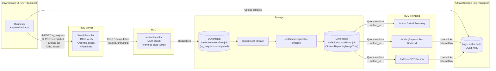

## Summary

This RFC defines the HUD-side ingestion and display layer for Out-of-Tree (OOT) CI results, building on RFC-0050 (Cross-Repository CI Relay for PyTorch Out-of-Tree Backends).

### Data Flow

**Key points:**
- Artifact URLs are included in the `completed` callback payload and flow through the Result Handler → HUD API → DynamoDB → ClickHouse → HUD UI
- HUD pages read `artifact_url` from ClickHouse and render it as an external link — no direct connection between HUD and downstream storage
- Both `in_progress` and `completed` records are replicated to ClickHouse; `SharedReplacingMergeTree` handles deduplication — when a `completed` record arrives for the same `dynamoKey`, it replaces the `in_progress` row

### What this RFC covers

- **Write path**: Downstream CI → Result Handler → HUD API → DynamoDB → ClickHouse
  - `in_progress` callbacks → DynamoDB via `UpdateItem` → replicated to ClickHouse (shows "running" indicators)
  - `completed` callbacks → DynamoDB via `UpdateItem` (merges into existing record) → replicated to ClickHouse (replaces `in_progress` row via `SharedReplacingMergeTree`)
  - Artifact URLs flow through the callback payload, not sent directly to HUD
- **Read path**: Three new HUD views:
  - `/oot` — Global OOT CI summary (cross-repo health overview, repos sorted by pass rate)
  - `/oot/[org]/[repo]` — Per-backend dashboard (matrix view: PRs × jobs, failure drill-down, external artifact links)
  - `/pr/[number]` — Collapsible "Out-of-Tree Backends" section in existing PR pages
- **Storage schemas**: DynamoDB table and ClickHouse table designs
- **DB protection**: Rate limiting (per-repo at relay), payload caps (2MB at HUD API)
- **Security**: OIDC authentication, trusted/untrusted payload split, dedicated `X-OOT-Relay-Token` header, error handling strategy, signed callback token proposal, 3-state machine for status transitions
- **Sample payloads**: Two-stage wire format examples (downstream → relay, relay → HUD) with full field definitions
- **Implementation plan**: 6-phase rollout with task-level breakdown:
  1. Storage Layer — DynamoDB + ClickHouse + replicator mapping
  2. HUD API Endpoint — types, extraction, `UpdateItem` write logic
  3. Relay Integration — handler → HUD forwarding, rate limiting, reusable GHA action
  4. HUD Frontend Pages — 3 views + saved ClickHouse queries
  5. End-to-End Validation — real downstream repo testing
  6. Security Hardening — callback token, state machine (future)

### Reference implementation

A reference implementation is available at [pytorch/test-infra#8069](https://github.com/pytorch/test-infra/pull/8069), which includes the API endpoint, ClickHouse schema, replicator mapping, saved ClickHouse queries, and all three frontend pages.

### HUD Mockup design
The draft OOT HUD UI mockup can be seen in [OOT HUD Mockup link](https://subinz1.github.io/rfcs/RFC-0054-assets/oot-hud-mockup.html)

### Status

Ready for review
